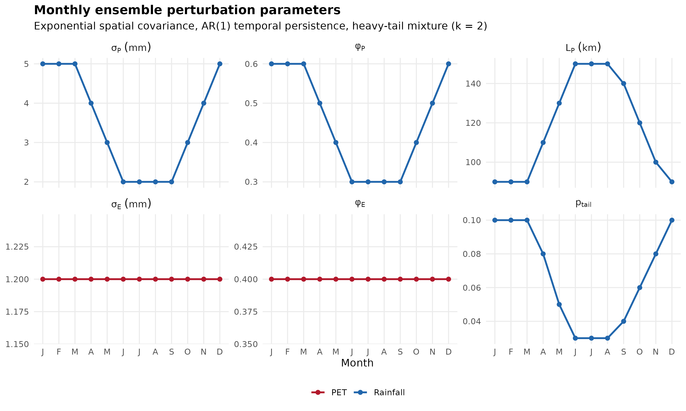
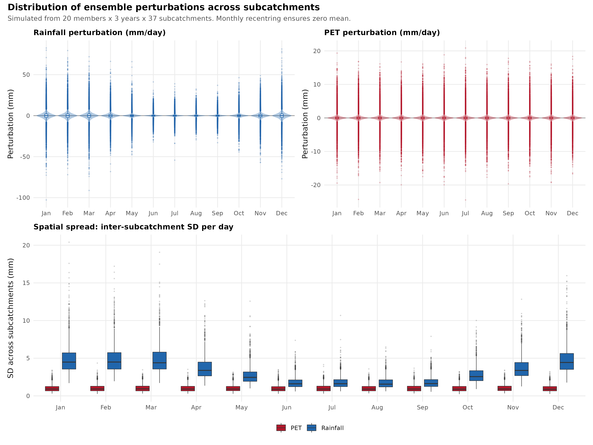
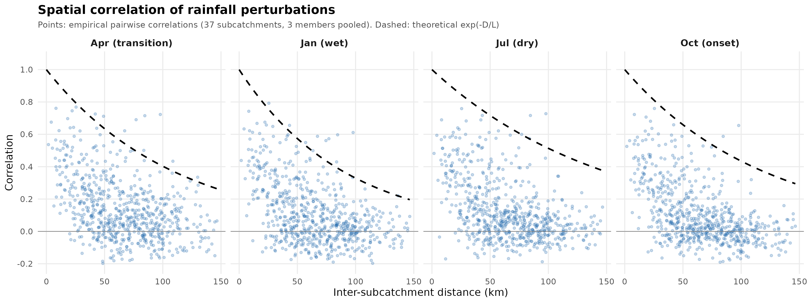

# Perturbed Rainfall Ensemble Generator

Generate spatio-temporally correlated perturbations of gridded daily rainfall and PET to create ensemble forcing datasets for hydrological modelling.

## Overview

Takes a historical daily forcing dataset (rainfall + PET, per subcatchment) and produces N ensemble members — plausible alternative realisations of the same climate signal. Perturbations are spatially correlated (exponential covariance, L ~90–150 km), temporally autocorrelated (AR(1), monthly-varying), and include a heavy-tail mixture (~3–10% of days inflated by 2x) to represent observational uncertainty in extremes. A zero-inflation guard preserves the dry/wet day structure (perturbations only applied when P > 0.5 mm) and monthly recentring keeps everything unbiased.

Optionally couples P and PET perturbations via negative correlation on daily spatial means (wetter days → lower PET).

Based on the spatial interpolation uncertainty characterisation in Jeffrey et al. (2001).

## Diagnostics

Generated by `scripts/plot_ensemble_diagnostics.R` for 37 Adelaide River subcatchments.

### Monthly parameters

Parameters vary by month — higher rainfall uncertainty in the wet season, shorter correlation lengths when convection dominates.



### Perturbation distributions

Violin plots of daily perturbation magnitude. Rainfall perturbations widen in the wet season (sigma_P = 5 mm vs 2 mm dry); PET is constant (sigma_E = 1.2 mm). Bottom panel is inter-subcatchment SD per day.



### Spatial correlation

Empirical pairwise correlations decay with distance, tracking the theoretical exp(-D/L). Correlation length: 90 km wet season, 150 km dry.



## Model

Per day *t*, the perturbation field across subcatchments is:

$$
eps_t = phi_m * eps_{t-1} + sqrt(1 - phi_m^2) * (C_m * Z_t)
$$

where:
- $phi_m$ is the month-specific AR(1) coefficient (0.3 in dry season to 0.6 in wet season)
- $C_m$ is the Cholesky factor of the spatial covariance matrix for month $m$
- $Z_t ~ N(0, I)$ with optional heavy-tail inflation
- The covariance is $Sigma = sigma^2 * exp(-D/L)$ where $D$ is inter-subcatchment distance (km) and $L$ is the correlation length

Perturbed forcing is then:

$$
P* = max(0, P + eps_P)     if P > pmin_mm, else P* = P
E* = max(0, E + eps_E)
$$

## Directory structure

```
rainfallEnsemble/
├── conf/
│   └── ensemble_parameters.yml     # All tunable parameters
├── R/
│   ├── forcing_uncertainty.R       # Core perturbation engine
│   ├── uncertainty_config.R        # Parameter normalisation
│   ├── spatial.R                   # Shapefile → distance matrix
│   └── forcing.R                   # Read SILO text files
├── scripts/
│   ├── download_silo.py            # Download SILO data from AWS
│   ├── run_ensemble.R              # Main runner script
│   ├── plot_ensemble_diagnostics.R # Generate diagnostic figures
│   └── requirements.txt            # Python dependencies
├── docs/
│   └── figures/                    # Diagnostic PNGs (tracked in git)
├── data/
│   ├── metadata/
│   │   ├── alias_map.csv           # Subcatchment ID mapping
│   │   └── namSubcatchmentAreaskm2.csv
│   ├── spatial/                    # Place shapefile here
│   └── forcing/                    # Downloaded/extracted forcing
└── outputs/
    └── ensemble_members/           # Generated ensemble members
```

## Quick start

### 1. Install dependencies

**R** (>= 4.1):
```r
install.packages(c("dplyr", "tidyr", "readr", "purrr", "stringr",
                    "lubridate", "tibble", "rlang", "sf", "units",
                    "yaml", "qs", "fs"))
# Optional for parallel:
install.packages(c("future", "future.apply"))
# For diagnostic figures:
install.packages(c("ggplot2", "patchwork"))
```

**Python** (>= 3.9):
```bash
pip install -r scripts/requirements.txt
```

### 2. Get forcing data

Place your subcatchment polygon shapefile in `data/spatial/` (default expects `NAMCatchments.shp` with a `MUID` attribute column).

**Option A: Use existing area-weighted SILO text files**

Place tab-delimited text files in `data/forcing/rainfall/` and `data/forcing/evap/`, following the naming convention:
```
Rainfall_{startYear}-{endYear}_{subcatchment_id}.txt
Evap_{startYear}-{endYear}_{subcatchment_id}.txt
```

Each file has a one-line header and two tab-delimited columns (`Time`, `Current`):
```
Rainfall[millimeter]:Step_Accumulated
Time	Current
1900-01-01 00:00:00	14.6575
1900-01-02 00:00:00	7.03879
```

**Option B: Download and extract from SILO AWS**

The Python downloader fetches SILO daily GeoTIFFs from `s3://silo-open-data` and computes area-weighted subcatchment means. Pixel weights use fractional coverage via [`exactextract`](https://github.com/isciences/exactextract).

```bash
# Download daily_rain and evap_morton_lake for 1900-2024
python scripts/download_silo.py --start 1900 --end 2024

# Or download only, then extract separately
python scripts/download_silo.py --start 1900 --end 2024 --skip-extract
python scripts/download_silo.py --start 1900 --end 2024 --skip-download
```

TIFFs are cached in `data/cache/silo_tif/` (~200 KB/day, ~9 GB/variable for 125 years). Output goes to `data/forcing/rainfall/` and `data/forcing/evap/`. For a different catchment, edit `BBOX` in the script and point `--shapefile` accordingly.

### 3. Run the ensemble

```bash
# Generate 50 ensemble members (default)
Rscript scripts/run_ensemble.R

# Customise
Rscript scripts/run_ensemble.R --n-members 100 --format csv
Rscript scripts/run_ensemble.R --config conf/my_parameters.yml
```

Output files are written to `outputs/ensemble_members/` as `.qs` (default) or `.csv` files, one per member. Each file contains:

| Column | Description |
|--------|-------------|
| `date` | Date (YYYY-MM-DD) |
| `subcatchment_id_std` | Standardised subcatchment ID |
| `rainfall_mm` | Perturbed daily rainfall (mm) |
| `pet_mm` | Perturbed daily PET (mm) |
| `forcingMember` | Ensemble member index |

## Configuration

See `conf/ensemble_parameters.yml`:

| Parameter | Description | Default |
|-----------|-------------|---------|
| `sigma_P` | Monthly rainfall perturbation SD (mm) | 2–5 mm (seasonal) |
| `phi_P` | Monthly AR(1) persistence for rainfall | 0.3–0.6 |
| `L_P_km` | Spatial correlation length for rainfall (km) | 90–150 km |
| `p_tail` | Monthly probability of heavy-tail event | 0.03–0.10 |
| `k_tail` | Heavy-tail inflation factor | 2.0 |
| `sigma_E` | PET perturbation SD (mm) | 1.2 mm (constant) |
| `rho_PE` | Monthly P-E coupling correlation | -0.10 to -0.20 |
| `pmin_mm` | Zero-inflation guard (mm) | 0.5 mm |
| `n_members` | Number of ensemble members | 50 |

## Other catchments

Swap the shapefile in `data/spatial/`, update the metadata CSVs, and edit `BBOX` in the downloader. The covariance parameters are calibrated for tropical/semi-arid northern Australia — other regions will need recalibration against Jeffrey et al. (2001) or local validation data.

## References

- Jeffrey, S.J., Carter, J.O., Moodie, K.B., & Beswick, A.R. (2001). Using spatial interpolation to construct a comprehensive archive of Australian climate data. *Environmental Modelling & Software*, 16(4), 309–330.
- SILO climate data: https://www.longpaddock.qld.gov.au/silo/
- SILO on AWS Open Data: https://registry.opendata.aws/silo/

## Licence

SILO data are freely available under the Creative Commons Attribution 4.0 International licence (CC BY 4.0), courtesy of the Queensland Government and the Australian Bureau of Meteorology.
